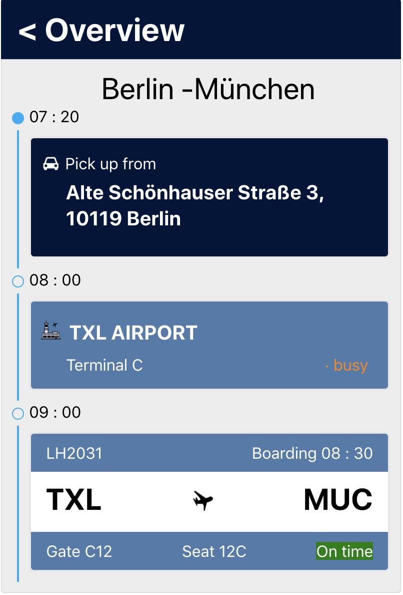

## Travel screen

This app was bootstrapped with create-react-app. Check `CREATE_REACT_APP_README.md` for additional info and available commands.

### Screen data

The data is received from `data.json` which can be easily replaced with api call. All the items from `data.segments` are rendered as travel steps with timestamps and highlighted active item.

### Further steps

* If the number of interactive elements increase, Redux can be used. Currently there is no need for it.

* More app pages and app sync with user location

* Responsive pages and mobile app creation